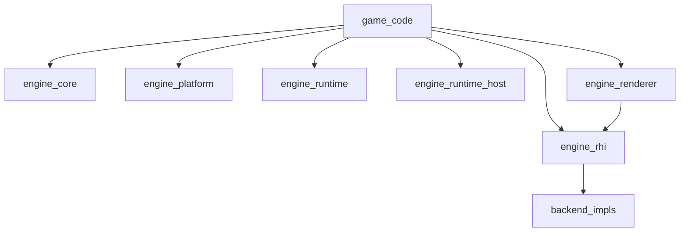

# Architecture and Directory Layout Verification

This document records a structured assessment of the repository’s top-level layout and the design rules documented under `docs/`, compared against common C++/CMake modular and layered-engine practice. It does not change code or prescribe a different on-disk layout.

**Assessment date:** 2026-05-11.

## Official “best practices” (framing)

- **There is no ISO or C++ standard that defines a canonical game-engine directory tree.** The project states this explicitly in [cpp-style.md](cpp-style.md) and aligns with **C++ Core Guidelines**-style consistency and **CMake target-based** organization.
- **CMake-oriented “official” guidance** (target-scoped commands, install and `find_package` export) matches [building.md](building.md) and the root `CMakeLists.txt` policy (for example `ExactVersion`, exported `MK_LIBRARY_TARGETS`).
- **Engine-specific trees** (Unreal, Godot, O3DE, etc.) are **product conventions**, not universal standards. This repository follows a common **SDK-style** shape: modular static libraries, optional GUI, and `games/` for products and samples.

**Conclusion:** There is no single “100% standard-compliant” layout for game engines. This tree **follows widely recommended C++/CMake principles**: explicit module boundaries, stable public include prefixes, and declared target dependencies.

## Is the directory structure appropriate for a game engine?

**Yes.** Documented roles map cleanly to on-disk locations.

| Area | Location | Role (from docs) |
| --- | --- | --- |
| Runtime modules | `engine/<module>/` (`core`, `math`, `scene`, `renderer`, `rhi`, …) | Feature libraries; `include/mirakana/...` + `src/` |
| GPU backends | `engine/rhi/<backend>/` | Isolated RHI implementations |
| Platform | `engine/platform/` (+ optional `sdl3`) | OS APIs behind contracts |
| Bridge layers | `runtime_rhi`, `runtime_scene`, `runtime_scene_rhi`, `runtime_host`, … | Prevent dependency inversion; see [architecture.md](architecture.md) |
| Editor | `editor/core/` (GUI-independent), `editor/src/` (Dear ImGui shell) | Testable core vs. shell |
| Games | `games/` | Products and samples |
| Package templates | `platform/android/`, `platform/ios/` | App packaging separate from engine modules |
| Verification | `tests/unit/`, `tests/fixtures/` | Centralized tests |
| Repository automation | `tools/` | PowerShell 7 entrypoints per `AGENTS.md` |

Layer sketch (summary of [architecture.md](architecture.md)):

## Clean implementation and backward compatibility

**Policy and build settings favor a greenfield, non–backward-compatible stance** unless a release policy says otherwise:

- `AGENTS.md`: backward compatibility is not required by default; avoid compatibility shims without a decision.
- **C++23 only:** `MK_CXX_STANDARD` must be `23` or configure fails.
- **`find_package(Mirakanai)` uses `ExactVersion`** ([building.md](building.md)): strict for consumers, not “loose” semver compatibility.

**Note:** A clean **directory** layout is not the same as **production completeness** of every subsystem. [architecture.md](architecture.md) lists many follow-ups per module; **architectural direction can be strong while feature maturity follows the roadmap**.

## Split vs. merge of folders and files

**Mostly aligned with recommended patterns.**

- **Module ≈ CMake target (`MK_*`)** with directories close to 1:1 helps dependency tracking, build parallelism, and testing.
- **`runtime_*` / `runtime_*_rhi` splits** deliberately enforce dependency direction versus a single monolithic `runtime` that would pull in GPU concerns.
- **`engine/tools`** aggregates development-time bridges; growth can create a “god module” risk, but [architecture.md](architecture.md) constrains **normal gameplay** from depending on it for ordinary play.

**Structural refinement (tools, v1):** `MK_tools` implementation sources are grouped under `engine/tools/shader/`, `engine/tools/gltf/`, `engine/tools/asset/`, and `engine/tools/scene/` as CMake `OBJECT` targets aggregated into `MK_tools` ([ADR 0003](adr/0003-directory-layout-clean-break.md), [spec](specs/2026-05-11-directory-layout-target-v1.md)).

**Optional future structural refinements** (beyond v1):

- Further splits of other `engine/*` modules or exported package components — separate plan only when justified.
- `engine/agent/manifest.json` is intentionally **outside** the C++ module include layout ([cpp-style.md](cpp-style.md)) as an **AI contract**; authoritative **source** JSON lives under `engine/agent/manifest.fragments/` and is composed by `tools/compose-agent-manifest.ps1` (see [ai-integration.md](ai-integration.md), `docs/adr/0002-agent-manifest-fragments-compose.md`). That exception is reasonable.

## Is the architecture “highest tier”?

**Cannot claim an absolute #1 rank; split the axes:**

- **Boundaries, dependency rules, headless-first design, and hiding RHI/platform behind contracts** read as **senior/architect-level** discipline. [architecture.md](architecture.md) acts as a **system boundary contract**, not a shallow README.
- If “highest tier” means **commercial engine completeness and ecosystem scale**, roadmap gaps (streaming, full navmesh tooling, etc.) mean **maturity lags** some shipped engines—that is **scope and time**, not proof the folder layout is wrong.

## Summary

| Lens | Verdict |
| --- | --- |
| Directory tree for a game engine | **Appropriate** (clear separation of modules, backends, editor, games, tests, packaging) |
| Relation to “official” norms | **Aligned with CMake/C++ common practice**; no single official engine layout exists |
| Clean / backward compatibility | **Greenfield-oriented policy and strict package versioning** |
| Splits and merges | **Sound layered design**; `runtime_*` boundaries are a quality positive |
| “Highest level” | **Strong boundary design and documentation**; **product completeness is a separate axis** |

For day-to-day rules, prefer [architecture.md](architecture.md), [cpp-style.md](cpp-style.md), and [building.md](building.md) as the authoritative sources; this file is a **dated verification snapshot**.
